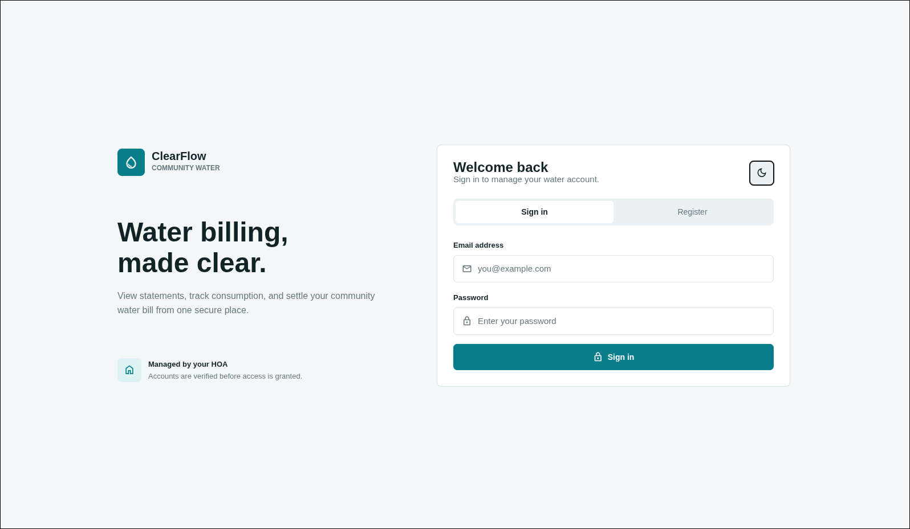

# Clear Flow Community Water Billing



A modern community water billing and management system built with **Expo (React Native)** and **Laravel**.


## Features

- Customer account management
- Water meter reading management
- Automated bill generation
- Payment tracking
- Consumption history
- Notifications and reminders
- Administrative dashboard and reporting
- Mobile-first user experience

## Technology Stack

### Mobile Application (`client/`)

- Expo
- React Native
- TypeScript
- Expo Router
- Axios
- React Query (if applicable)

### Backend API (`server/`)

- Laravel
- MySQL / MariaDB
- Laravel Sanctum Authentication
- Eloquent ORM
- RESTful API Architecture

---

# Prerequisites

Before starting, ensure you have the following installed:

## General

- Node.js 20+
- npm or yarn
- composer

## Mobile Development

- Expo CLI
- Android Studio (Android development)
- Xcode (macOS only for iOS development)

## Backend Development

- PHP 8.2+
- Composer 2+
- MySQL 8+ or MariaDB
- Laravel CLI (optional)

---

# Installation

## 1. Clone the Repository

```bash
git clone https://github.com/your-username/clear-flow-community-water-billing.git

cd clear-flow-community-water-billing
```

---

# Backend Setup (Laravel)

Navigate to the server directory:

```bash
cd server
```

## Install Dependencies

```bash
composer install
```

## Create Environment File

Copy the example environment file:

```bash
cp .env.example .env
```

Generate the application key:

```bash
php artisan key:generate
```

## Configure Environment Variables

Edit `.env`:

```env
APP_NAME="Clearflow"
APP_ENV=local
APP_DEBUG=true
APP_URL=http://localhost:8000

DB_CONNECTION=mysql
DB_HOST=127.0.0.1
DB_PORT=3306
DB_DATABASE=clearflow
DB_USERNAME=root
DB_PASSWORD=

...
```

## Run Database Migrations

```bash
php artisan migrate
```

If the project contains seeders:

```bash
php artisan db:seed
```

Or:

```bash
php artisan migrate --seed
```

## Start Laravel Development Server

```bash
php artisan serve
```

The API will be available at:

```text
http://localhost:8000
```

---

# Frontend Setup (Expo)

Open a new terminal:

```bash
cd client
```

## Install Dependencies

```bash
npm install
```

## Create Environment File

Create:

```bash
.env
```

Example:

```env
EXPO_PUBLIC_API_URL=http://localhost:8000/api
```

### Android Emulator

```env
EXPO_PUBLIC_API_URL=http://10.0.2.2:8000/api
```

### Physical Device

Replace with your computer's local IP address:

```env
EXPO_PUBLIC_API_URL=http://192.168.1.100:8000/api
```

---

## Start Expo Development Server

```bash
npm run dev
```

or

```bash
npx expo start
```

You can run the application using:

- Expo Go
- Android Emulator
- iOS Simulator
- Development Build

---

# API Authentication

The backend uses Laravel Sanctum for API authentication.

Ensure Sanctum is properly configured before using protected routes.

Example authenticated request:

```http
Authorization: Bearer {token}
```

---

# Development Workflow

### Start Backend

```bash
cd server

php artisan serve
```

### Start Frontend

```bash
cd client

npm run dev
```

Both services must be running during development.

---

# Building the Mobile App

## Android

```bash
cd client

eas build --platform android
```

## iOS

```bash
cd client

eas build --platform ios
```

For EAS builds, ensure you are logged in:

```bash
npx eas login
```

---

# Code Quality

## Laravel

```bash
php artisan test
```

## Expo

```bash
npx expo lint
```

---

# License

This project contains code derived from Expo and other third-party components licensed under the [MIT License](LICENSE-MIT) and their respective licenses.

Unless otherwise noted, the application code, business logic, assets, and original works developed for this project are licensed under the Polyform Noncommercial License 1.0.0.

See the [LICENSE](LICENSE.md) file for details.

Copyright © 2026 Melvin Jones Repol.
